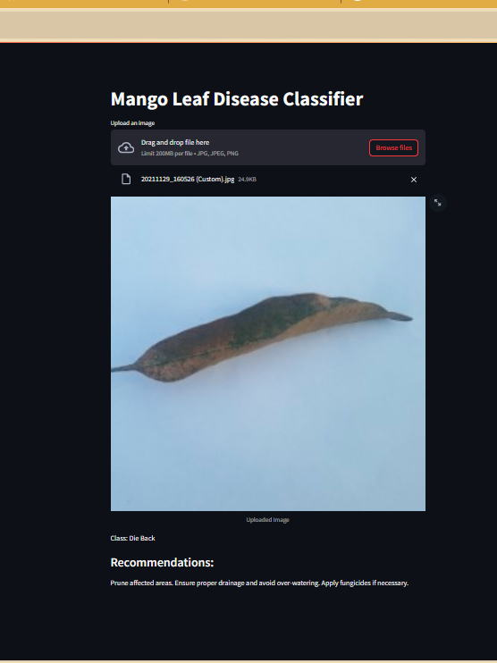

# Mango Leaf Disease Prediction

This project is designed to predict mango leaf diseases using machine learning. It includes a streamlit web application for a user friendly interaction.

## Table of Contents
- [Introduction](#introduction)
- [Web Application](#web-application)
  - [Usage](#web-application-usage)
- [Contributing](#contributing)

## Introduction

Mango Leaf Disease Prediction is a project that uses a trained machine learning model to classify diseases in mango leaves based on input images. The project consists of two main components: the ipynb for training and the streamlit web app.
The dataset for this project can be downloaded from [here](https://prod-dcd-datasets-cache-zipfiles.s3.eu-west-1.amazonaws.com/hxsnvwty3r-1.zip
).

## Web Application

The web application allows users to upload an image of a mango leaf, and it provides real-time predictions for the disease type. It uses a streamlit backend for image processing and prediction.

### Web Application Usage

1. Clone the repository to your local machine:

```bash
git clone https://github.com/Mark-Finley/Mango-Leaf-Disease-Classifier.git
cd mango-leaf-disease-prediction
```

2. Install the required Python packages (you may want to use a virtual environment):

```bash
pip install -r requirements.txt
```

3. Run the web application:

```bash
streamlit run app.py
```

4. Open a web browser and navigate to `http://localhost:8501` to use the application.

Below is a sample run of the app


## Project Structure

The project is organized as follows:

```
Mango Leaf Disease Prediction/
├── app.py
├── mangoLeafDiseasePrediction.ipynb
├── requirments.txt
├── README.md
```

## Contributing

Contributions are welcome! If you'd like to contribute to this project or report issues, please visit the [GitHub repository](https://github.com/Mark-Finley/Mango-Leaf-Disease-Classifier.git) for more information.

To contribute:
  - create a branch "branch/featureName"
  - commit to the branch and create pull request.

Feel free to contribute, report issues, or provide feedback. Happy coding!